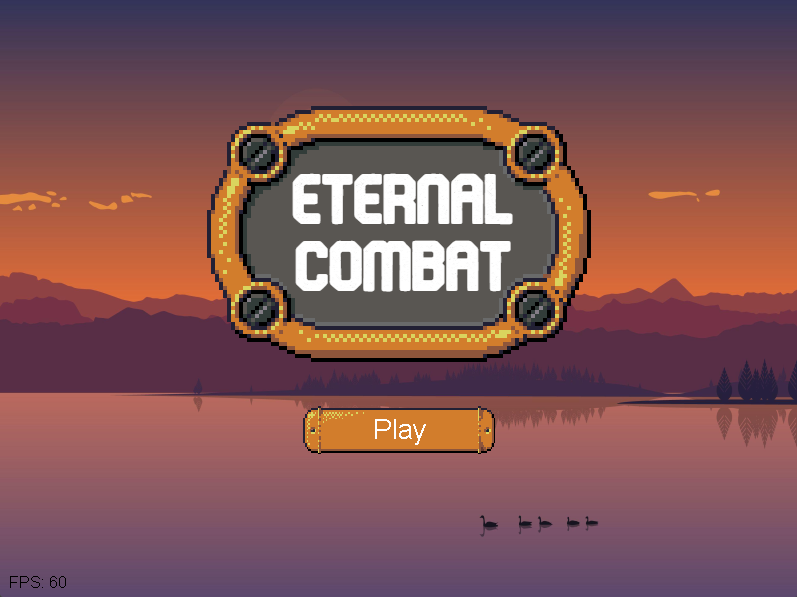

# EternalCombat #

 
_Defeat endless hordes of skeletons in this 2D Java video game!_ 

## Overview ##
**Eternal Combat** is a 2D shoot-em-up arcade game, built entirely from scratch in Java.
In the game, you are a knight equipped with a bow, and you have to survive an endless onslaught of skeletons.

The game gets difficult as you progress; skeleton archers and knights make it that much harder to survive.
When you kill a skeleton, there's a chance you'll receive a powerup to help you in your fight.

## Technical Features ##
* Difficulty curve increases as you keep playing
* Unique variants of skeletons (skeleton, archer, knight)
* Built-in soundtrack and sound effects (you can toggle these in the in-game menus)
* Leaderboard for arcade-style competition!
* Custom UI components and game menus

## How to Play ##
Use WASD to move the player, and left-click to shoot your bow.
If you see a powerup, run your player into the powerup to claim it.
Press ESC to pause the game and access the settings.

## Download ##
You will need Java installed in order to play this game.
In the root directory of this repository, download the file `EternalCombat.jar`. Then, run the jar file by double-clicking it or opening it via **Command Prompt** or **Terminal**.

The game was built on Java 8. At the time of writing this, it works fine on Java 21.

## Screenshots ##

 
_Press "New Game" to play. Outlast enough skeletons and you might end up on the leaderboard! Open the "Leaderboard" menu to check your all-time high scores!_

 
_The heart powerup boosts a player back to full health!_

